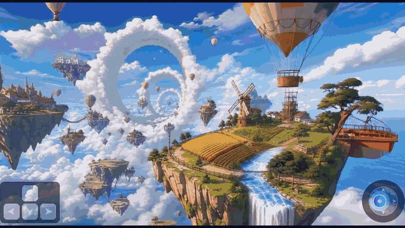
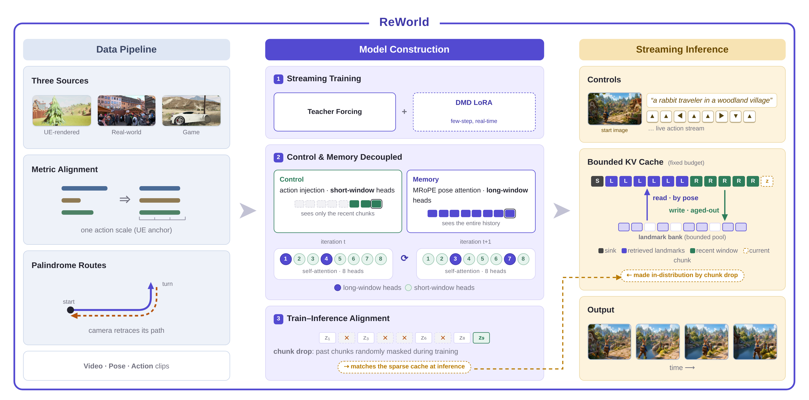

<div align="center">

<picture>
  <source media="(prefers-color-scheme: dark)" srcset="assets/logo_dark.png">
  
</picture>

### ReWorld: An Interactive World Model with Long-Horizon Memory 🌍

<p>
  <a href="https://zhifeichen097.github.io/ReWorld/"></a>
  <a href="https://arxiv.org/abs/2608.23565"></a>
  <a href="https://huggingface.co/"></a>
  <a href="LICENSE.md"></a>
</p>

<br>

<a href="assets/demo/reworld_demo_small.mp4">
  
</a>
<sub><i>▶ Click the preview to watch the demo reel with sound (HD file: assets/demo/reworld_demo.mp4).</i></sub>

</div>

---

## Overview

ReWorld is an interactive world model: you drive the camera with keyboard-and-mouse actions, and it streams the world back to you chunk by chunk. Its window-split training scheme decouples control from memory, so precise action following and long-horizon consistency are learned without competing against each other. At inference, a bounded KV cache paired with a pose-indexed landmark bank keeps GPU memory constant regardless of rollout length, while still retrieving the right past views when the camera revisits a place. Trained on metric-aligned multi-source data and distilled to 4 denoising steps, ReWorld streams 704×1280 video in real time.

## News

- **2026-08** — Paper released on arXiv: [ReWorld: An Interactive World Model with Long-Horizon Memory](https://arxiv.org/abs/2608.23565).
- **2026-08** — Inference code released. Pretrained checkpoints are on the way — see [Checkpoints](#checkpoints).

## Installation

Tested with Python 3.10 and PyTorch ≥ 2.4 on CUDA GPUs.

```bash
git clone https://github.com/zhifeichen097/ReWorld.git
cd ReWorld

conda create -n reworld python=3.10 -y
conda activate reworld

pip install -r requirements.txt
pip install flash-attn --no-build-isolation   # required by the attention kernels
pip install peft                              # required for the 4-step DMD LoRA
```

Notes:

- `flash-attn` (v2 or v3) is required — the cross-attention path calls it directly.
- `peft` is only needed when loading the few-step LoRA (the default config does).

## Checkpoints

**ReWorld weights are not released yet.** The table below lists what will be published; until then, the inference commands cannot be run end-to-end. The Wan2.2 base model is already public and can be downloaded today.

| Checkpoint | Resolution | Latent frames | File (expected) | Status |
|---|---|---|---|---|
| ReWorld generator (EMA) | 704×1280 | 96 | `checkpoints/reworld_generator_ema.pt` | Coming soon |
| ReWorld 4-step DMD LoRA | 704×1280 | 96 | `checkpoints/reworld_dmd_lora.pt` | Coming soon |
| Wan2.2-TI2V-5B (base, VAE + T5) | — | — | `checkpoints/Wan2.2-TI2V-5B/` | [Official Wan release](https://huggingface.co/Wan-AI/Wan2.2-TI2V-5B) |

Expected layout (paths are set in `configs/plucker720p_dmd_infer.yaml`; the base-model directory can also be pointed to via the `WAN_MODEL_DIR` environment variable):

```
checkpoints/
├── Wan2.2-TI2V-5B/            # official Wan2.2 release (T5, tokenizer, VAE)
├── reworld_generator_ema.pt   # coming soon
└── reworld_dmd_lora.pt        # coming soon
```

## Inference

Two entry points, each with a plain and a `_v2` variant. **Use the `_v2` scripts** — they swap in the improved landmark bank (bounded memory, top-k pose retrieval) and the 720p decode memory fix, with an identical CLI.

| Script | Purpose |
|---|---|
| `inference_i2v_v2.py` | Image-to-world: condition on a start image, roll out scripted camera trajectories |
| `inference_action_v2.py` | Text-to-world: batch rollouts, or interactive keyboard control in the terminal |

### Image-to-world with bounded memory (recommended)

Rolls out every `prompt@keysequence` line in `assets/mc_eval_random_keys_96latent_more7.txt` (set in the config), conditioned on your start image, with the pose-indexed landmark bank capping the KV cache at 12 chunks (1 sink + 5 recent + 6 landmarks retrieved from a 30-entry bank):

```bash
python inference_i2v_v2.py \
    --config_path configs/plucker720p_dmd_infer.yaml \
    --mode dataset \
    --init_image path/to/start_image.png \
    --num_inference_steps 4 \
    --kv_policy v15b \
    --kv_budget_chunks 12 \
    --kv_n_sink 1 \
    --kv_recent_w 5 \
    --output_folder outputs/reworld_i2v
```

On GPUs where 720p VRAM is tight, prefix with `BANKV2_HOT_GPU=0` to keep the bank in pinned CPU memory.

### Interactive mode (single GPU)

Type one mouse key (`i`/`k`/`j`/`l`/`u` — look up/down/left/right/none) and one keyboard key (`w`/`a`/`s`/`d` — translate, or `q` — stay) per 4-latent-frame chunk:

```bash
python inference_action_v2.py \
    --config_path configs/plucker720p_dmd_infer.yaml \
    --mode interactive \
    --prompt "A cinematic Minecraft village at sunset" \
    --num_inference_steps 4 \
    --output_folder outputs/interactive
```

### Batch rollouts on multiple GPUs

```bash
torchrun --nproc_per_node=4 inference_action_v2.py \
    --config_path configs/plucker720p_dmd_infer.yaml \
    --mode dataset \
    --num_inference_steps 4 \
    --output_folder outputs/eval_action
```

### Key flags

| Flag | Default | Meaning |
|---|---|---|
| `--config_path` | `configs/plucker720p_dmd_infer.yaml` | Base config (model, resolution, rollout list) |
| `--mode` | `dataset` | `dataset` (scripted trajectories) or `interactive` (live keyboard) |
| `--init_image` | — | *(i2v only)* start image; VAE-encoded as the first latent |
| `--prompt` | — | Text prompt (interactive mode) |
| `--output_folder` | `outputs/inference_action` | Where videos (`.mp4`, 24 fps) are written |
| `--num_latent_frames` | from config (96) | Rollout length in latent frames (96 → 381 pixel frames ≈ 16 s) |
| `--num_inference_steps` | 30 | Denoising steps; use **4** with the DMD LoRA |
| `--kv_policy` | — | KV-cache policy: `v15b` (landmark bank), `window`, `naive`, `select`; unset = unbounded full cache |
| `--kv_budget_chunks` | 20 | Total KV budget in 4-latent-frame chunks (bounded policies) |
| `--kv_landmark_k` / `--kv_retrieve_k` | 30 / 6 | Landmark-bank capacity / top-k landmarks retrieved per step |
| `--checkpoint_path` / `--lora_checkpoint_path` | from config | Override generator / LoRA checkpoint paths |
| `--seed` / `--num_samples` | 0 / 1 | Sampling seed / samples per prompt |

The full flag reference — trajectory key-string format, all memory policies and their knobs, environment variables, ablation switches — is in [`docs/INFERENCE.md`](docs/INFERENCE.md).

## Method

Training splits each video window so that action-conditioned generation and memory-conditioned generation are supervised separately, which decouples control fidelity from long-horizon recall. At inference, a bounded KV cache holds sink and recent chunks at full resolution, while a landmark bank indexed by camera pose stores distinct past viewpoints and retrieves the top-k nearest ones for attention — memory stays constant while the world stays consistent.

<div align="center">
<picture>
  <source media="(prefers-color-scheme: dark)" srcset="assets/reworld_framework_dark.png">
  
</picture>
</div>

## Acknowledgements

ReWorld is built on the [Wan2.2](https://github.com/Wan-Video/Wan2.2) backbone (DiT, VAE, and text encoder) and adapts the causal-distillation codebase of [Self-Forcing](https://github.com/guandeh17/Self-Forcing). We thank the authors of both projects for open-sourcing their work.

## Citation

If you find ReWorld useful, please cite:

```bibtex
@article{chen2026reworld,
  title   = {ReWorld: An Interactive World Model with Long-Horizon Memory},
  author  = {Chen, Zhifei and Wang, Luozhou and Shen, Guibao and Yan, Dongyu and
             Yang, Shuai and Xu, Tianshuo and Du, Yihua and Wang, Wei and
             Gui, Tianyi and Huang, Lianghua and Chen, Yingcong},
  journal = {arXiv preprint arXiv:2608.23565},
  year    = {2026}
}
```

## License

This project is released under the [CC BY-NC-SA 4.0](LICENSE.md) license, for research and non-commercial use only. The Wan2.2 base model is subject to its own license terms.
